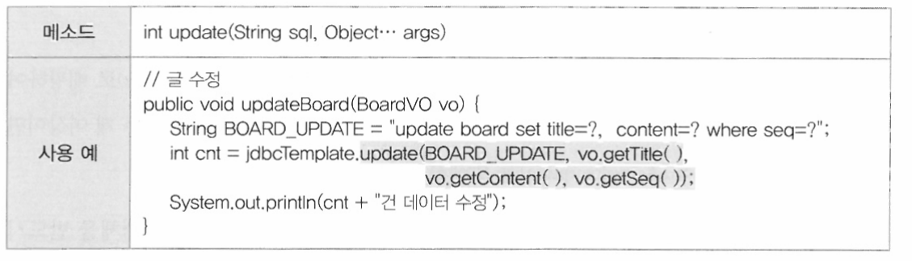
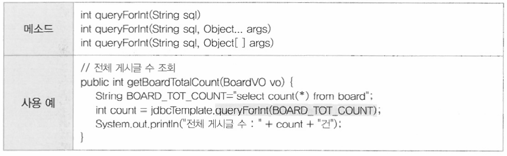

# 스프링 AOP

    스프링의 의존성 주입을 이용하면 비즈니스 컴포넌트를 구성하는 객체들의 결합도를 떨어뜨릴 수 있어서 의존관계를 쉽게 변경할 수 있다.
    스프링의 IoC가 결합도와 관련된 기능이라면 AOP(Aspect Oriented Programming)는 응집도와 관련된 기능이라 할 수 있다.

## 1.1 AOP 이해하기

    새로운 메소드를 구현하는 가장 일반적인 방법은 기존에 잘 만들어진 메소드를 복사해서 구현하는 것이다. 이렇게 되면 결국 비즈니스 메소드에 부가적인 코드들이 반복해서 등장한다. 따라서 코드 분석과 유지보수를 어렵게 만든다. AOP는 이러한 부가적인 공통코드들을 효율적으로 관리하는 데 주목한다.

    AOP를 이해하는 데에 가장 중요한 핵심 개념이 바로 관심 분리(Separation of Concerns)이다.

    AOP에서는 메소드마다 공통으로 등장하는 로깅이나 예외, 트랜잭션 처리 같은 코드들을 횡단 관심(Crosscutting Concerns)이라고 한다.
    이에 반해 사용자의 요청에 따라 실제로 수행되는 핵심 비즈니스 로직을 핵심 관심(Core Concerns)이라고 한다.

    이 두 관심을 완벽하게 분리 할 수 있다면, 우리가 구현하는 메소드에는 실제 비즈니스로직만으로 구성할 수 있으므로 더욱 간결하고 응집도 높은 코드를 유지할 수있다. 문제는 기존의OOP(Object-Oriented-Programming)언어에서는 횡단 관심에 해당하는 공통 코드를 완벽하게 독립적인 모듈로 분리해내기가 어렵다.

    정리하면 OOP처럼 모듈화가 뛰어난 언어를 사용하여 개발하더라도 공통 모듈에 해당하는 클래스 객체를 생성하고 공통 메소드를 호출하는 코드가 비즈니스 메소드에 있다면 핵심 관심과 횡단 관심을 완벽하게 분리할 수는 없다.
    하지만 스프링의 AOP는 이런 OOP의 한계를 극복할 수 있도록 도와준다.

## 1.2 AOP 실행

    AOP 소스 추가 부분
    pom.xml dependency에 aop관련 라이브러리를 추가한다.
    ```java
        <!-- aop관련 라이브러리 추가 -->
		<dependency>
			<groupId>org.aspectj</groupId> <!-- 부분적인 프로젝트나 조직에서의 라이브러리 집합을 식별하기 위해 제공한다. -->
			<artifactId>aspectjrt</artifactId> <!-- artifactId는 버전 정보를 생략한 jar 파일의 이름이다 -->
			<version>${org.aspectj-version}</version>
		</dependency>
		
		<dependency>
			<groupId>org.aspectj</groupId>
			<artifactId>aspectjweaver</artifactId>
			<version>1.8.8</version>
		</dependency>
    ```

    application.xml 부분

    namespace로 aop추가 후

    aop 관련 횡단 로직 소스 빈 추가
    ```
	<bean id="log" class="com.springbook.biz.common.LogAdvice"></bean>
	<bean id="log4j" class="com.springbook.biz.common.Log4jAdvice"></bean>
    ```

    aop 설정
    ```java
	<aop:config>
		<aop:pointcut id="allPointcut" expression="execution(* com.springbook.biz..*Impl.*(..))" />
	
		<aop:aspect ref="log">
			<aop:before pointcut-ref="allPointcut" method="printLog" />
		</aop:aspect>
	
		<aop:aspect ref="log4j">
			<aop:after pointcut-ref="allPointcut" method="printLog4j"/>
		</aop:aspect>
	</aop:config>    
    ```

    설정을 추가하면 해당 메소드들이 실행됨을 확인할 수 있다.

    스프링의 aop는 클라이언트가 핵심 관심에 해당하는 비즈니스 메소드를 호출할 때, 횡단 관심에 해당하는 메소드를 실행해준다.
    이때 핵심 관심 메소드와 횡단 관심 메소드사이에서 소스상의 결합은 발생하지 않는다.

# 2 AOP 용어 및 기본 설정

## 2.1 AOP 용어 정리

## 2.1.1 조인포인트 (Joinpoint)

    조인포인트는 클라이언트가 호출하는 모든 비즈니스 메소드로써, 클래스의 모든 메소드를 조인포인트라고 한다. 조인포인트를 '포인트컷 대상' 또는 '포인트컷 부로'라고도 하는데, 이는 조인포인트 중에서 '포인트컷'이 선택되기 때문이다

## 2.1.2 포인트컷 (Pointcut)

    클라이언트가 호출하는 모든 비즈니스 메소드가 조인포인트라면, 포인트컷은 필터링된 조인포인트를 의미한다. 예를 들어, 트랜잭션을 처리하는 공통 기능을 만들었다고 가정하자. 이 횡단 관심 기능은 등록, 수정, 삭제 기능의 비즈니스 메소드에 대해서는 당연히 동작해야 하지만, 검색 기능의 메소드에 대해서는 트랜잭션과 무관하므로 동작할 필요가 없다. 이렇게 수많은 비즈니스 메소드 중에서 우리가 원하는 특정 메소드에서만 공통 기능을 수행시키기 위해서 포인트컷이 필요하다.
    포인트컷을 이용하면 메소드가 포함된 클래스와 패키지는 물론이고 메소드 시그니처까지 정확하게 지정할 수 있다.

    포인트컷은 <aop:pointcut> 엘리먼트로 선언하며, id 속성으로 포인트컷을 식별하기 위한 유일한 문자열을 선언한다.

    ex)
    ```java
    <aop:pointcut id="allPointcut" expression="execution(* com.springbook.biz..*Impl.*(..))" />
    <aop:pointcut id="getPointcut" expression="execution(* com.springbook.biz..*Impl.get*(..)" />
    ```

    중요한 것은 expression 속성인데, 이 값을 설정하는것에 따라 필터링되는 메소드가 달라진다. 

    * com.springbook.biz..*Impl.get*(..)
    리턴타입, 패키지경로 클래스명 메소드명 및 매개변수

    첫 번째로 등록한 allPointcut은 리턴타입과 매개변수를 무시하고 com.springbook.biz 패키지로 시작하는 클래스 중에서 이름이 Impl로 끝나는 클래스의 모든 메소드를 포인트컷으로 설정한다.

    두 번째로 등록한 getPointcut은 allPointcut과 같지만 get으로 시작하는 메소드만 포인트 컷으로 설정한다.


[매개변수 지정방법](https://wpunch2000.tistory.com/22)


## 2.1.3 어드바이스(Advice)

    어드바이스는 횡단 관심에 해당하는 공통 기능의 코드를 의미하며, 독립된 클래스의 메소드로 작성된다. 그리고 어드바이스로 구현된 메소드가 언제 동작할지 스프링 설정파일을 통해서 지정할 수 있다.

    예를 들어, 트랜잭션 관리 기능의 어드바이스 메소드가 있다고 할때 이 어드바이스가 비즈니스 로직이 수행되기 전에 동적하는 것은 아무런 의미가 없다. 당연히 로직 수행 후에 트랜잭션을 커밋 또는 롤백 처리하면 된다.

    스프링에서는 어드바이스의 동작 시점을 'before','after', ;after-returning','after-throwing', 'around' 등 다섯 가지로 지정할 수 있다.


    ```java
    <aop:before pointcut-ref="allPointcut" method="printLog" />
    ```

    aop:before 자리에 동작 시점을 넣는다.


## 2.1.4 위빙(Weaving)

    위빙은 포인트컷으로 지정한 핵심 관심 메소드가 호출될 때, 어드바이스에 해당하는 횡단 관심 메소드가 십입되는 과정을 의미한다.

    이 위빙을 통해서 비즈니스 메소드를 수정하지 않고도 횡단 관심에 해당하는 기능을 추가하거나 변경할 수 있다.

    횡단코드를 핵심코드에 적용되는 일련의 과정을 의미합니다

    스프링에서는 런타임 위빙 방식을 지원한다.
    
    런타임 위빙이란, Runtime때 실제 객체를 가상의 객체로 적용시키는 과정이다.

## 2.1.5 애스팩트(Aspect) 또는 어드바이저(Advisor)

    Aspect Oriented 
    Programming이라는 이름에서 알 수 있듯이 AOP의 핵심은 Aspect이다. Aspect는 포인트컷과 어드바이스의 결합으로서, 어떤 포인트컷 메소드에 대해서 어떤 어드바이스 소스를 실행할지 결정한다. 이 Aspect 설정에 따라 AOP의 동작 방식이 결정되므로 AOP 용어중 가장 중요한 개념이라고 할 수 있다.

    ```
    <bean id="log" class="com.springbook.biz.common.LogAdvice"></bean>
	
	<aop:config>
		<aop:pointcut id="getPointcut" expression="execution(* com.springbook.biz..*Impl.get*(com.springbook.biz.board.BoardVO))" />
	
		<aop:aspect ref="log4j">
			<aop:after pointcut-ref="getPointcut" method="printLog4j"/> <!-- get으로 시작하는 메소드에만 해당 횡단관심이 작동한다. -->
		</aop:aspect>
	</aop:config>
	
    ```

    1. getPointcut으로 설정한 포인트컷 메소드가 호출된다.(expression으로 설정한 경로)
    2. log라는 어드바이스 객체의 printLog메소드가 실행된다 (bean 객체 설정)
    3. 메소드의 동작 시점(어드바이스)에 따라 실행되다.

## 2.1.6 AOP용어 종합


1. 사용자는 비즈니스 컴포넌트의 여러 조인포인트를 호출한다,
2. 이때 특정 포인트 컷으로 지정한 메소드가 호출되는 순간
3. 어드바이스 객체의 어드바이스 메소드가 실행된다. \
-- 이떄 어드바이스 메소드의 동작 시점을 5가지로 지정할 수 있다.
4. 포인트컷으로 지정한 메소드가 호출될 때 어드비아스 메소드를 삽입하도록 하는 설정을 애스팩트라고 한다.

## 2.2 AOP 엘리먼트

    스프링은 AOP관련 설정을 XML방식과 어노테이션 방식으로 지원한다.
    우선 xml설정을 먼저 확인 후 어노테이션 설정을 살펴본다.

### 2.2.1 <<aop:config>>엘리먼트     

    aop설정에서 <aop:config>는 루트 엘리먼트이다. 

    스프링 설정 파일 내에 <aop:config> 엘리먼트는 여러 번 사용할 수 있으며, <aop:config> 엘리먼트 하위에는 <aop:pointcut>, <aop:aspect> 엘리먼트가 위치할 수 있다. 

AOP 엘리먼트들의 포함 관계


[루트 엘리먼트란](#루트-엘리먼트)

### 2.2.2 <<aop:pointcut>> 엘리먼트

    <aop:pointcut> 엘리먼트는 포인트컷을 지정하기 위해 사용하며, <aop:config>의 자식이나  <aop:aspect>의 자식 엘리먼트로 사용할 수 있다. 그러나 <aop:aspect>하위에 설정된 포인트 컷은 해당 <aop:aspect>에서만 사용할 수 있다.

    <aop:pointcut>은 여러 개 정의할 수 있으며, 우일한 아이디를 할당하여 애스팩트를 설정할 때 포인트컷을 참조하는 용도로 사용한다.


    allPointcut이라는 포인트컷은 com.springbook.biz 패키지로 시작하는 클래스 중에서 이름이 Impl로 끝나는 클래스의 모든 메소드를 포인트컷으로 설정하고 있다. 그리고 애스팩트 설정에서 <aop:before> 엘리먼트의 pointcut-ref 속성으로 포인트 컷을 참조하고 있다.

### 2.2.3 <<aop:aspect>>

    애스팩트는 <aop:aspect> 엘리먼트로 설정하며, 핵심 관심에 해당하는 포인트컷 메소드와 횡단 관심에 해당하는 어드바이스 메소드를 결합하기 위해 사용하낟. 애스팩트를 어떻게 설정하느냐에 따라서 위빙 결과가 달라지므로 AOP에서 가장 중요한 설정이라고 할 수 있다.

<<aop:aspect> 엘리먼트의 속성과 의미>


1. getPointcut으로 설정한 포인트컷 메소드가 호출될 때 
2. log라는 어드바이스 객체에서
3. printLog() 메소드가 실행되고
4. printLog() 메소드 동작 시점이<<aop:before>>이다.

### 2.2.4 <<aop:advsor>> 엘리먼트

    <aop:advisor> 엘리먼트는 포인트컷과 어드바이스를 결합한다는 점에서 애스팩트와 같은 기능을 한다.
    하지만 트랜잭션 설정 같은 몇몇 특수한 경우는 애스팩트가 아닌 <aop:advisor> 엘리먼트를 사용해야 한다.

    AOP설정에서 애스팩트를 사용하려면 어드바이스의 아이디와 메소드 이름을 알아야한다.
    그러나 만약 어드바이스 객체의 아이디를 모르거나 메소드 이름을 확인할 수 없을 때는 <aop:aspect> 엘리먼트를 사용할 수 없다.
<<aop:aspect> 엘리먼트 아이디, 메소드>


    스프링 컨테이너는 설정 파일에 등록된 <tx:advice>엘리먼트를 해석하여 트랜잭션 관리 기능의 어드바이스 객체를 메모리에 생성한다. <tx:advice>를 설정에 따라서 생성되는 어드바이스의 기능과 동작 방식은 달라진다.

    문제는 이렇게 생성된 어드바이스의 아이디는 확인이 가능하지만 메소드 이름은 확인이 되지 않는다. 이럴 때는 <aop:aspect>를 사용하지 못하므로 <aop:advisor>엘리먼트를 사용해야한다.

[tx:advice 관련](https://isstory83.tistory.com/115)


## 2.3 포인트컷 표현식

    포인트컷을 이용하면 어드바이스 메소드가 적용될 비즈니스 메소드를 정확하게 필터링할 수 있다.

    포인트컷 표현식은 execution 명시자를 이용하며, execution 명시자 안에 포인트컷 표현식을 기술한다.

포인트컷 표현식의 구조와 의미


1. 리턴 타입지정

1. 패지키 지정

3. 클래스 지정

4. 메소드 지정

5. 매개변수 지정
 

# 3. 어드바이스 동작 시점

    어드바이스는 각 조인포인트에 삽입되어 동작할 횡단 관심에 해당하는 공통 기능미며, 동작시점은 각 AOP기술마다 다르며 스프링에서는 다섯 가지의 동작 시점을 제공한다.

동작 시점
1. Before : 비즈니스 메소드 실행 전 동작
2. After Returning : 비즈니스 메소드가 성공적으로 리턴되면 동작
3. After Throwing : 비즈니스 메소드 실행 중 예외가 발생하면 동작 (try~catch문에서 catch문에 해당)
4. After : 비즈니스 메소드가 실행된 후, 무조건 실행 (try~catch~finally문에서 finally문에 해당)
5. Around : 메소드 호출 자체를 가로채 비즈니스 메소드 실행 전후에 처리할 로직을 삽입할 수 있음

    어드바이스 메소드 동작 시점은 <aop:aspect> 엘리먼트 하위에 각각 <aop:before>,<aop:after-returning>,<aop:after-throwing>,<aop:after>,<after-around> 엘리먼트를 이용하여 지정한다.

## 3.1 Before 어드바이스

    Before 어드바이스는 포인트컷으로 지정된 메소드 호출 시, 메소드가 실행되기 전에 처리될 내용들을 기술하기 위해 사용된다. 

Before 어드바이스 구조


## 3.2 After Returung 어드바이스

    After Returning 어드바이스는 포인트컷으로 지정된 메소드가 정상적으로 실행되고 나서, 메소드 수행 결과로 생성된 데이터를 리턴하는 시점에 동잗한다. 

    따라서 비즈니스 메소드 수행 결과로 얻은 결과 데이터를 이용하여 사후 처리 로직을 추가할 때 사용한다.

After Returning 어드바이스 동작 시점


## 3.3 After Throwing 어드바이스

    After Throwing 어드바이스는 포인트컷으로 지정한 메소드가 실행되다가 예외가 발생하는 시점에서 동작한다.
    try-catch-finally구문에서 catch블록에 해당한다.

    따라서 예외 처리 어드바이스를 설정할 때 사용한다.

After Throwing 어드바이스 동작 시점
    

## 3.4 After 어드바이스

    try-catch-finally구문에서 finally블록에 해당한다.

    예외 발생 여부에 상관없이 무조건 수행된다.
After 어드바이스 동작 시점


## 3.5 Around 어드바이스

    하나의 어드바이스가 비즈니스 메소드 실행 전과 후 모두 동작하여 로직을 처리하는 경우에 사용한다.

Around 어드바이스 동작 시점


    Around 어드바이스는 클라이언트의 메소드 호출을 가로챈다. 그래서 클라이언트가 호출한 비즈니스 메소드가 실행되기 전에 사전 처리 로직을 수행할 수 있으며, 비즈니스 메소드가 모두 실행되고 나서 사후 처리 로직을 수행할 수 있다.

```java
	public Object Around(ProceedingJoinPoint joinPoint) throws Throwable {
		
		System.out.println("메소드 실행 전 모두 실행");
		Object object = joinPoint.proceed();
		System.out.println("메소드 실행 후 모두 실행");
		
		return object;
	}
```

    joinPoint.proceed() 메소드 호출 앞에 작성된 코드는 Before어드바이스와 동일하게 동작하며, 
    joinPoint.proceed() 메소드 호출 뒤에 작성된 코드는 After어드바이스와 동일하게 동작한다.

    클라이언트의 요청을 가로챈 어드바이스(Around)는 클라이언트가 호출한 비즈니스 메소드를 호출하기 위해 
    ProceedingJoinPoint객체를 매개변수로 받아야 한다. 
    
    ProceedingJoinPoint객체의 proceed() 메소드를 통해서 비즈니스 메소드를 호출할 수 있다.


# 4. JointPoint와 바인드 변수

    황단 관심에 해당하는 어드바이스 메소드를 의미 있게 구현하려면 클라이언트가 호출한 비즈니스 메소드의 정보가 필요하다. 스프링에서는 이런 다양한 정보들을 이용할 수 있도록 JoinPoint인터페이스를 제공한다.

## 4.1 JointPoint메소드

1. Signature getSignature() : 클라이언트가 호출한 메소드의 시그니처(리턴타입, 이름, 매개변수) 정보가 저장된 Signature 객체 리턴
2. Object getTarget() : 클라이언트가 호출한 비즈니스 메소드를 포함하는 비즈니스 객체 리턴
3. Object[] getArgs() : 클라이언트가 메소드를 호출할 때 넘겨준 인자 목록을 Object 배열로 리턴

    Before, After Returning, After Throwing, After 어드바이스에서는 JoinPoint를 사용하며 유일하게 
    Around 어드바이스에서만 ProceedingJoinPoint를 사용한다. 

    ProceedingJoinPoint는 JoinPoint를 상속받아 구현이 되었으며 JoinPoint가 가진 모든 메소드를 지원하며 proceed()메소드가 추가 되었다.


    getSignature() 메소드가 리턴하는 Signature객체를 이용하면, 호출되는 메소드에 대한 다양한 정보를 얻을 수 있다.

1. String getName() : 클라이언트가 호출한 메소드 이름 리턴
2. String toLongString() : 클라이언트가 호출한 메소드의 리턴타입, 이름, 매개변수를 패키지 경로까지 포함하여 리턴
3. String toShortString() : 클라이언트가 호출한 메소드 시그니처를 축약한 문자열로 리턴

    JoinPoint 객체를 사용하려면 JoinPoint를 어드바이스 메소드 매개변수로 선언만 하면 된다.
    그러면 클라이언트가 비즈니스 메소드를 호출할 때, 스프링 컨테이너가 JoinPoint객체를 생성한다.
그리고 메소드 호출과 관련된 모든 정보를 JoinPoint객체에 저장하여 어드바이스 메소드를 호출할 때 인자로 넘겨준다.

```java
    public void printLog(JoinPoint jp){ //JoinPoint 매개변수로 선언
        System.out.println("로그 동작")
    }
```

## 4.2 Before 어드바이스

    Before 어드바이스는 비즈니스 메소드가 실행되기 전에 동작할 로직을 구현한다.
    따라서 호출된 메소드 시그니처만 알 수 있으면 다양한 사전 처리 로직을 구현할 수 있다.

```java

	public void beforeLog(JoinPoint joinPoint) {
		
		String method = joinPoint.getSignature().getName(); // 메소드명을 알 수 있다.
		Object[] args = joinPoint.getArgs(); //해당 메소드로 넘긴 인자 값을 알 수 있다.
		
		System.out.println("메소드 : " + method);
		System.out.println("args : " + args[0].toString());
		
	}

```

## 4.3 After Returning 어드바이스

    After Returning 어드바이스 메소드가 수행되고 나서, 결과 데이터를 리턴할 때 동작하는 어드바이스 이다.
    따라서 어떤 메소드가 어떤 값을 리턴햇는지를 알아야 사후 처리 기능을 다양하게 구현할 수 있다.

    ``` java

	public void afterReturn(JoinPoint joinPoint, Object object) { 
		
		String method = joinPoint.getSignature().getName(); // 메소드명을 알 수 있다.

		if (object instanceof UserVO ) {
			UserVO userVO = (UserVO)object;
			
			System.out.println("userVO : " + userVO);
			
			if(userVO.getRole().equals("Admin")) {
				System.out.println(userVO.getName() + " [로그인]");
			}
		}

		System.out.println("메소드 : " + method);
		System.out.println("메소드 리턴값 : " + object.toString()); //리턴값 확인
	}
    ```

    어드바이스 메소드에 JoinPoint만 선언되어 있다면 스프링 설정 파일은 수정하지 않아도 된다.
    하지만 바인드 변수가 추가되었다면 반드시 바인드 변수에 대한 매핑 설정을 스프링 설정 파일에 추가해야 한다.
    returning속성을 사용한다.

    ```xml
        <aop:after-returning pointcut-ref="userPointcut" method="afterReturn" returning="object"/>
        <!-- returning속성을 사용하여 리턴값을 받을 매개변수를 지정한다. -->
    ```

## 4.4 After Throwing 어드바이스

    After Throwing 어드바이스는 비즈니스 메소드가 수행되다가 예외가 발생할 때 동작한다.

    따라서 어떤 메소드에서 어떤 예외가 발생했는지를 알아야 정확한 예외처리를 구현할 수 있다.


    ```java
        public void afterThrowing(JoinPoint joinPoint, Exception exception) {
            
            String method = joinPoint.getSignature().getName(); // 메소드명을 알 수 있다.

            System.out.println("메소드 : " + method);
            System.out.println("예외 메세지 : " + exception.getMessage()); //에러메세지

        }    
    ```

    어드바이스 메소드에 JoinPoint만 선언되어 있다면 스프링 설정 파일은 수정하지 않아도 된다.
    하지만 바인드 변수가 추가되었다면 반드시 바인드 변수에 대한 매핑 설정을 스프링 설정 파일에 추가해야 한다.
    throwing속성을 사용한다.

    ```xml
        <aop:after-throwing pointcut-ref="userPointcut" method="afterThrowing" throwing="exception"/>
    ```

## 4.5 Around 어드바이스

    Around 어드바이스는 다른 어드바이스와 다르게 반드시 ProceedingJoinPoint객체를 매개변수로 받아야한다.
    ProceedingJoinPoint객체는 비즈니스 메소드를 호출하는 proceed()메소드를 가지고 있으며 joinpoint를 상속했다.

    xml에서는 별도의 설정이 필요 없으며 java에서 매개변수로 ProceedingJoinPoint객체를 받기만 하면 된다.

    ```java
    public Object around(ProceedingJoinPoint joinPoint) throws Throwable {
            System.out.println("전");
            
            Object object = joinPoint.proceed();
            
            System.out.println("후");
            return object;
        }
    ```

# 5 어노테이션 기반 AOP

## 5.1 어노테이션 기반 AOP설정

## # 5.1.1 어노테이션 사용을 위한 스프링 설정

    AOP를 어노테이션으로 설정하려면 가장 먼저 스프링 설정 파일에 <aop:aspectj-autoproxy>엘리먼트를 선언해야 한다.


    ```xml
    <aop:aspectj-autoproxy></aop:aspectj-autoproxy> 
    ```
    해당 엘리먼트만 선언하면 스프링 컨테이너는 AOP관련 어노테이션들을 인식하고 용도에 맞게 처리해준다.

    AOP 관련 어노테이션들은 어드바이스 클래스에 설정한다. 
    그리고 어드바이스 클래스에 선언된 어노테이션들을 스프링 컨테이너가 처리하게 하려면, 
    반드시 어드바이스 객체가 생성되어야 한다.
    따라서 어드바이스 클래스는 반드시 스프링 설정 파일에 <bean>등록하거나 @Service어노테이션을 사용하여 컴포넌트가 검색될 수 있도록 해야 한다.

1. Annotation설정 : @Service
2. XML 설정 : <bean id="log" class="com.springbook.biz.common.LogAdvice"></bean>

### 5.1.2 포인트컷 설정

    xml설정에서 포인트컷을 선언할 때는 <aop:pointcut>엘리먼트를 사용했다. 그리고 선언된 여러 포인트컷을 식별하기 위한 유일한 아이디를 지정했으며, 이후에 애스팩트 설정에서 특정 포인트컷을 참조할 수 있다.

xml 포인트컷 설정

    ```xml
    <aop:pointcut id="getPointcut" expression="execution(* com.springbook.biz..*Impl.get*(com.springbook.biz.board.BoardVO))" />
    ```


    어노테이션 설정으로 포인트컷을 선언할 때는 @Pointcut을 사용하며, 하나의 어드바이스 클래스 안에 여러 개의 포인트컷을 선언할 수 있다. 
    따라서 여러 포인트컷을 식별하기 위한 식별자가 필요한데, 이때 참조 메소드를 이용한다.

    참조 메소드는 메소드 몸체가 비어있는 , 즉 구현 로직이 없는 메소드이다. 따라서 어떤 기능 처리를 목적으로 하지 않고 단순히 포인트컷을 식별하는 이름으로만 사용한다.

java 포인트컷 설정

    ```java
   	@Pointcut("execution(* com.springbook.biz.. get*.*(..))")
	public void getPointcut() {} 
    ```

### 5.1.3 어드바이스 설정

    어드바이스 클래스에는 횡단 관심에 해당하는 어드바이스 메소드가 구현되어 있다.
    이 어드바이스 메소드가 언제 동작할지 결장하여 관련된 어노테이션을 메소드 위에 설정하면 된다.

    어드바이스의 동작 시점은 xml설정과 마찬가지로 다섯가지가 제공된다.

    어드바이스 설정시 반드시 메소드가 결합될 포인트컷을 참조해야 한다.

xml 어드바이스 설정

```xml
        <aop:before pointcut-ref="allPointcut" method="printLog" />
```

java 어드바이스 설정

```java
	@Before("allPointcut()") /*포인트컷*/
	public void printLog() {
		System.out.println("before");
	}

```

### 5.1.4 애스팩트 설정

    AOP 설정에서 가장 중요한 애스팩트는 @Aspect를 이용하여 설정한다.

    애스팩트는 포인트컷과 어드바이스의 결합이다.
    따라서 @Aspect가 설정된 애스팩트 객체에는 반드시 포인트컷과 어드바이스를 결합하는 설정이 있어야 한다.

xml 애스팩트 설정
```xml
	<bean id="log" class="com.springbook.biz.common.LogAdvice"></bean>
    
    <aop:config>
        <aop:pointcut id="allPointcut" expression="execution(* com.springbook.biz..*Impl.*(..))" />
		<aop:aspect ref="log">
			<aop:before pointcut-ref="allPointcut" method="printLog" />
		</aop:aspect>
    </aop:config>
```

java 애스팩트 설정

```java
@Service
@Aspect //Aspect 어노테이션 객체 아래에는 pointcut과 advice가 있어야한다.
public class LogAdbvice {

	@Pointcut("execution(* com.springbook.biz.. *Impl.*(..))") /* 포인트컷 */
	public void allPointcut() {}
	
	@Before("allPointcut()") /* 어드바이스 */
	public void printLog() {
		System.out.println("before");
	}
}
```

## 5.2 어드바이스 동작 시점

### 5.2.1 Before 어드바이스

```JAVA
	@Before("allPointcut()") /*포인트컷*/
	public void printLog(JoinPoint joinPoint) {
		System.out.println(joinPoint.getSignature().getName()); //메소드명
		System.out.println(joinPoint.getArgs()[0].toString());  //인자확인
	}
```

### 5.2.2 After Returning 어드바이스

```java
	@AfterReturning(pointcut = "allPointcut()", returning = "object")
	public void afterReturningLog(JoinPoint joinPoint, Object object) {
		System.out.println("메소드명 : " + joinPoint.getSignature().getName());
		System.out.println("메소드리턴값 : " + object.toString());
	}
```    

### 5.2.3 After Throwing 어드바이스

```java
	@AfterThrowing(pointcut = "allPointcut()", throwing = "exception")
	public void afterThrowingLog(JoinPoint joinPoint, Exception exception) {
		System.out.println("메소드명 : " + joinPoint.getSignature().getName());
		System.out.println("메소드에러구문 : " + exception.getMessage());
	}
```

### 5.2.4 Around 어드바이스

```java
	@Around("LogAdbvice.allPointcut()")
	public Object around(ProceedingJoinPoint joinPoint) throws Throwable {
		System.out.println("전");
		
		Object object = joinPoint.proceed();
		
		System.out.println("후");
		return object;
	}
```

# 6 스프링 JDBC

## 6.2 JdbcTemplate 클래스

    JdbcTemplate는 GoF 디자인 패턴 중 템플릿 메소드 패턴이 적용된 클래스이다.
    템플릿 메소드 패턴은 복잡하고 반복되는 알고리즘을 캡슐화해서 재사용하는 패턴으로 정의할 수 있다.

    템플릿 메소드 패턴을 이용하면 반복해서 사용되는 알고리즘을 템플릿 메소드로 캠슐화할 수 있어서 JDBC처럼 코딩 순서가 정형화된 기술에서 유용하게 사용할 수 있다.

JdbcTemplate의 위치와 역활
    

    JdbcTemplate은 JDBC의 반복적인 코드를 제거하기 위해 제공하는 클래스다. 따라서 DAO클래스에서는 JdbcTemplate클래스가 제공하는 템플릿 메소드를 호출하여 DB연동을 간단하게 처리할 수 있다.
    그러면 JdbcTemplate클래스는 내부적으로 jdbc api를 이용하여 실제 db 연동 작업을 처리한다.

## 6.3 스프링 JDBC 설정    


### 6.3.1 라이브러리 추가
    스프링  jdbc를 이용하려면 pom.xml 파일에 DBCP관련 <depencency>설정을 추가해야 한다.

```xml
		<!-- DBCP -->
		<dependency>
			<groupId>commons-dbcp</groupId>
			<artifactId>commons-dbcp</artifactId>
			<version>1.4</version>
		</dependency>
```

### 6.3.2 DataSource 설정

```xml
	<!-- datasource 설정  -->
	<bean id="dataSource" class="org.apache.commons.dbcp.BasicDataSource" destroy-method="close">
		<property name="driverClassName" value="org.h2.Driver" />
		<property name="url" value="jdbc:h2:tcp://localhost/~/test" />
		<property name="username" value="sa" />
		<property name="password" value="" />
	</bean>
```


### 6.3.3 프로퍼티 파일을 활용한 DataSource 설정

    PropettyPlaceholderConfigurer를 이용하여 외부의 프로퍼티 파일을 참조하여 DataSource를 설정할 수 있다.
    properties 파일 생성 후

```properties
jdbc.driver=org.h2.Driver
jdbc.url=jdbc:h2:tcp://localhost/~/test
jdbc.username=sa
jdbc.password=
```

``` xml
	<!-- 외부 프로퍼티 파일 참조 설정 -->
	<context:property-placeholder location="classpath:config/database.properties"/>
	
	<!-- datasource 설정  -->
	<bean id="dataSource" class="org.apache.commons.dbcp.BasicDataSource" destroy-method="close">
		<property name="driverClassName" value="${jdbc.driver}" />
		<property name="url" value="${jdbc.url}" />
		<property name="username" value="${jdbc.username}" />
		<property name="password" value="${jdbc.password}" />
	</bean>
```

## 6.4 JdbcTempate 메소드

### 6.4.1 update() 메소드

    insert,update,delete 구문을 처리하기 위해서는  JdbcTempate클래스의 update 메소드를 사용해야한다.
    update메소드의 사용법은 "?"에 값을 설정하는 방식에 따라 크게 두 가지 형태가 있다.

1. SQL구문에 설정된 ? 수만큼 값들을 차례대로 나열하는 방식



2. Object 배열 객체에 SQL 구문에 설정된 ? 수만큼의 값들을 세팅하여 배열 객체를 두 번째 인자로 전달하는 방식


### 6.4.2 queryForInt() 메소드

    select 구문으로 검색된 정숫값을 리턴받으려면 queryForInt() 메소드를 사용한다.



### 6.4.3 queryForObject() 메소드

    select 구문의 실행 결과를 특정 자바 객체로 매핑하여 리턴받을 때 사용한다.
    queryForObject()메소드는 검색 결과가 없거나 검색 결과가 두 개 이상이면 예외를 발생시킨다.

    

    검색 결과를 특정 VO 객체에 매핑하여 리턴하려면 RowMapper인터페이스를 구현한 RowMapper클래스가 필요하다. 결국 RowMapper 클래스는 테이블당 하나씩은 필요하다.

    RowMapper객체를 qureyForObject() 메소드의 매개변수로 넘겨주면, 스프링 컨테이너는 sql구문을 수행한 후 자동으로 RowMapper 객체의 mapRow() 메소드를 호출한다.

### 6.4.4 query() 메소드

    queryForObject()가 select문으로 객체 하나를 검색할 때 사용하는 메소드라면, 
    query() 메소드는 select문의 실행 결과가 목록일 때 사용한다.

    기본 사용법은 queryForObject()메소드와 같다.

    


    query() 메소드가 실행되면 여러 건의 row정보가 검색되며, 검색된 데이터 row수만큼 mapRow()메소드가 실행된다.
    그리고 list 컬렉션에 저장되어 리턴한다.

## 6.5 DAO클래스 구현

### 6.5.1 JdbcDaoSupport 클래스 상속

1. Dao 클래스에 JdbcDaoSupport클래스를 상속 받는다

```java
    //DAO(Data Access Object)
    @Repository
    public class BoardDAOSpring extends JdbcDaoSupport { }
```
2. 부모 클래스의 setDataSource() 메소드를 호출하여 데이터소스 객체를 의존성 주입해야 한다.

```java
	@Autowired
	public void setSuperDataSource(DataSource dataSource) {
		super.setDataSource(dataSource);
	}
```

### 6.5.2 JdbcTemplate 클래스 <bean> 등록, 의존성 주입

1. 스프링 설정 파일에 JdbcTemplate 클래스를 <bean> 등록한다.

```XML
	<!-- Spring JDBC 설정 -->
	<bean id="jdbcTemplate" class="org.springframework.jdbc.core.JdbcTemplate">
		<property name="dataSource" ref="dataSource"></property>
	</bean>
```

2. @Autowired 어노테이션을 이용하여 JdbcTemplate 타입의 객체를 의존성 주입 처리하면 된다.

```JAVA
	@Autowired
	private JdbcTemplate jdbcTemplate;
```

3. 서비스단에서 Dao객체를 이용하여 DB연동을 처리할수 있도록 @autowired 설정을 한다.

```java
@Service("boardService")
public class BoardServiceImpl implements BoardService {

	@Autowired
	private BoardDAOSpring boardDAO;
}
```

# 7 트랜잭션 처리

    스프링에서도 EJB와 마찬가지로 트랜잭션 처리를 컨테이너가 자동으로 처리하도록 설정할 수 있다.
    이를 선언적 트랜잭션 처리라고 한다.
    
    스프링의 트랜잭션 설정에서는 XML기반의 AOP설정만 사용할 수 있고, 어노테이션은 사용할 수 없다.
    애스팩트를 설정하는 것도 <aop:aspect> 엘리먼트를 사용하지 못하고 <aop:advisor> 엘리먼트를 사용해야 한다.


## 7.1 트랜잭션 네임스페이스 등록

    트랜잭션을 제어하는 어드바이스를 설정하기 위해 스프링 설정 파일에 트랜잭션 관련 네임스페이스도 추가해야 한다.    

## 7.2 트랜잭션 관리자 등록

    트랜잭션 관련 설정에서 가장 먼저 등록하는 것은 트랜잭션 관리자 클래스이다.

    스프링은 다양한 트랜잭션 관리자를 지원하는데, 어떤 기술을 이용해서 데이터베이스 연동을 처리했느냐에 따라
    트랜잭션 관리자가 달라진다. 
    모든 트랜잭션 관리자는 PlatformTransactionManager인터페이스를 구현한 클래스다
    따라서 스프링이 제공하는 모든 트랜잭션 관리자는 트랜잭션 관리에 필요한 commit,rollback 메소드를 가지고 있다.


스프링 설정 파일에 DataSourceTransactionManager 클래스 빈등록

```xml
	<bean id="txtManager" class="org.springframework.jdbc.datasource.DataSourceTransactionManager">
		<property name="dataSource" ref="dataSource"></property>
	</bean>
```

    DataSourceTransactionManager를 bean등록했다고 해서 자등으로 트랜잭션이 관리되는 것은 아니다.
    
    DataSourceTransactionManager도 다른 트랜잭션 관리자와 마찬가지로 메소드를 오버라이드하여 구현하고 있을 뿐이지 객체 스스로 메소드를 실행할 수 없다.

    트랜잭션 관리자를 이용하여 트랜잭션을 제어하는 어드바이스를 등록해야 한다.

## 7.3 트랜잭션 어드바이스 설정

    트랜잭션 관리 기능의 어드바이스는 <tx:advice> 엘리먼트를 사용하여 설정한다.


    트랜잭션 관리 기능의 어드바이스는 직접 구현하지 않으며, 스프링 컨테이너가 <tx:advice> 설정을참조하여 자동으로 생성한다.

    이 말은 트랜잭션관리 어드바이스 객체에 클래스 이름이나 메소드를 확인할 수 없다라는 의미이다.

    위 설정은 txAdvice라는 어드바이스가 앞에서 설정한 txManager를 이용하여 트랜잭션을 관리한다는 설정이다.
    그리고 <tx:attributes>의 자식 엘리먼트로 <tx:method>엘리먼트를 이용하여 트랜잭션을 적용할 메소드를 지정할 수 있다. 
    
    get으로 시작하는 모든 메소드는 읽기 전용으로 처리되어 트랜잭션 관리 대상에서 제외하고 나머지 메소드들은 트랜잭션 관리에 포함한다.

<tx:method>엘리먼트 속성


# 단어장

### 루트 엘리먼트
 
 모든 XML 문서는 단 하나의 루트 엘리먼트(root element)를 갖는다. 루트 엘리먼트는 자식 엘리먼트를 포함할 수 있으며, 자식 엘리먼트는 다시 그 지신의 자식 엘리먼트를 포함할 수 있다. 이러한 방식으로 엘리머트들은 트리 형태의 계층 구조를 이루게 된다.


