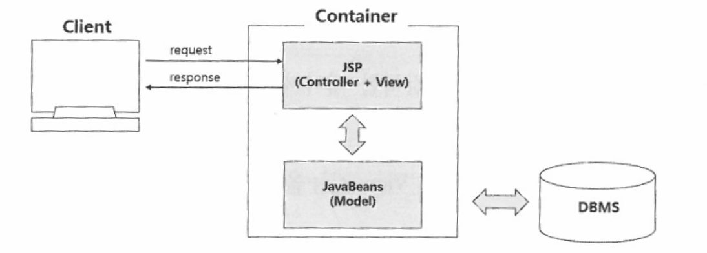
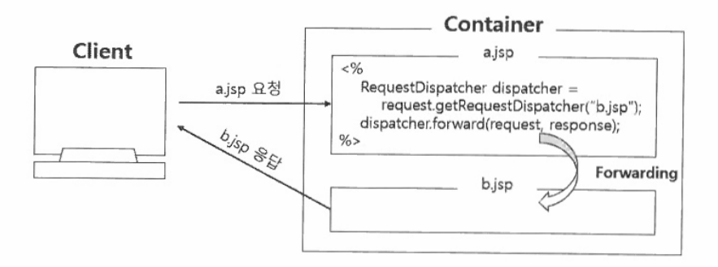
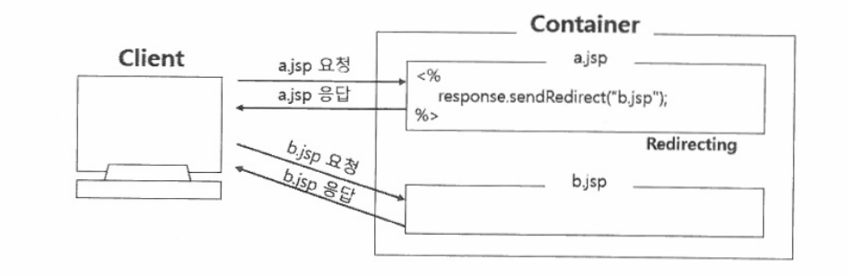
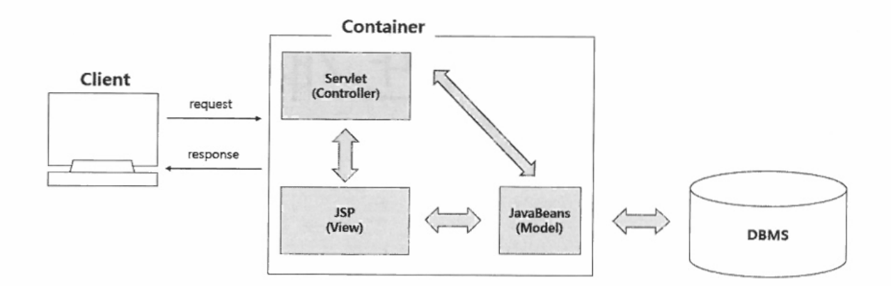
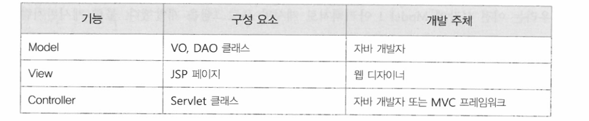
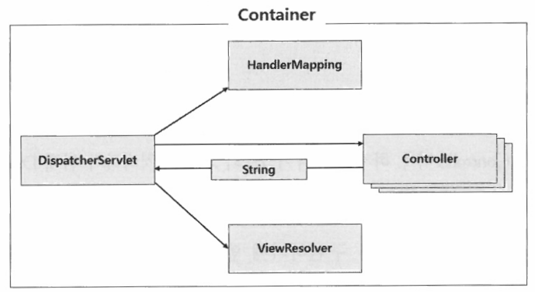
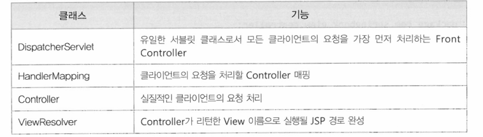

# DAY3

# Model 1 아키텍처로 게시판 개발

## 1.1 Model 1 아키텍쳐 구조

    Model1아키텍처는 JSP와 JavaBeans만 사용하여 웹 개발을 하는 것이다

    Model1 아키텍처에서 살펴볼 것은 Model기능의 JavaBeans다.

    Model의 정확한 의미는 데이터베이스 연동 로직을 제공하면서 DB에서 검색한 데이터가 저장되는 자바 객체다. 
    VO, DAO클래스가 Model기능의 자바 객체이다.

    Model1 아키텍처에서 jsp파일은 Controller와 View 기능을 모두 처리한다.

    Controller는 사용자의 요청 처리와 관련된 자바 코드를 의미한다.

    그리고 JSP에서는 Model을 사용하여 검색한 데이터를 사용자가 원하는 화면으로 제공하기 위해 마크업을 사용한다. 
    대표적으로 HTML, CSS를 사용하며 마크업이 View 기능을 담당한다.    

    Model1 구조는 JSP파일에서 Controller, View 기능을 모두 처리한다는 특징을 가진다.

    Model1 구조는 jsp파일에 자바 코드, 마크업 코드들이 뒤섞여 있어서 역할 구분이 어려우며, JSP파일에 대한 디버깅과 유지보수가 어려운 단점이 있다.
    
    Model2, MVC(Model View Controller)아키텍처가 등장하였으며 
    Model2는 Model, View, Controller 요소로 기능을 분리하고 개발을 진행한다.

## 1.2 로그인 기능 구현

    포워드(Forward)와 리다이렉트(Redirect) 차이

    포워드 방식 RequestDispatcher를 이용하여 응답으로 사용할 jsp화면으로 넘겨서,
    포워드된 화면이 클라이언트에 전송되는 방식이다.
    이 방식은 한 번의 요청과 응답으로 처리되므로 실행 속도는 빠르지만,
    클라이언트 브라우저에서 url이 바뀌지 않아 응답이 어디에서 들어왔는지 확인할 수 없다.

    리다이렉트는  요청된 JSP에서 일단 브라우저로 응답 메시지를 보냈다가 다시 서버로 재요청하는 방식이다.

    즉, 포위드 방식과 다르게 일단 응답이 브라우저로 들어간 다음, 재요청하는 방식이다. 따라서 응답이 들어온 파일로 브라우저의 url이 변경되지만, 두 번의 요청과 응답으로 처리되므로 실행 속도는 포워드 방식보다 느리다.

    

# 3 Model2 아키텍처로 게시판 개발

## 3.1 Model2 아키텍처 구조

    Model2아키텍처에서 가장 중요한 특징은 Controller의 등장이며
    Controller는 서블릿 클래스를 중심으로 구현한다.

    Model아키텍처에서는 기존에 JSP가 담당했던 Controller로직이 별도의 Controller 기능의 서블릿으로 옮겨졌다.
    따라서 기존에 Model1 아키텍처로 개발한 프로그램에서 JSP파일에 있는 자바 코드만 Controller로 이동하면 Model2 아키텍처가 된다.

    결과적으로 Controller로직이 사라진 JSP에서는 View와 관련된 다지안만 남게 된다.

    

# 4 MVC 프레임워크 개발

## 4.1 MVC 구조

    DispatcherServlet 클래스 하나로 Controller 기능을 구현할 경우
    클라이언트의 모든 요청을 하나의 서블릿이 처리하게 된다. 
    그럴 경우 수많은 분기처리 로직을 가질 수 밖에 없고, 이는 오히려 개발과 유지보수를 어렵게 만든다.

MVC 프레임워크  구조
    

MVC 프레임워크 클래스 역활

## 4.2 MVC 프레임워크 구현

    1) Controller 인터페이스 작성
    Controller를 구성하는 요소 중에서 DispatcherServlet은 클라이언트의 요청을 가장 먼저 받아들이는 Front Controller이다.

    1. 클라이언트의 요청을 받은 DispatcherServlet은 
    2. HandlerMapping을 통해 Controller객체를 검색한다.
    3. 검색된 Controller 실행한다.    

    2) Controller 구현

    3) HandlerMapping 클래스 작성
    HandlerMapping은 모든 Controller객체들을 저장하고 있다고, 클라이언트의 요청이 들어오면 Controller를 검색하는 기능을 제공한다.
    HandlerMapping객체는 DispatcherServlet이 사용하는 객체이다.
    따라서 DispatcherServlet이 생성되고 init() 메소드가 호출될 때 단 한 번 생성된다.

    4) ViewResolver 클래스 작성
    ViewResolver 클래스는 Controller가 리턴한 View 이름에 접두사(prepix), 접미사(suffix)를 결합하여 최종으로 실행될 View 경로와 파일명을 완성한다.(servlet-context.xml의 기능)
    HandlerMapping과 마찬가지로 DispatcherServlet의 init() 메소드가 호출될 때 생성된다.

    5) DispathcerServlet 수정
    

1. 클라이언트가 로그인 버튼을 클릭하여 'login.do' 요청하면 dispatcherServlet이 요청을 받는다.
2. dispatcherServlet은 handlerMapping 객체를 통해 로그인 요청을 처리할 Controller를 검색하고
3. 검색된 Controller의 handlerRequest()메소드를 호출하면 로그인 로직이 처리된다
4. 로그인 처리 후 화면 정보가 리턴되면
5. dispathcerServlet은 viewResolver를 통해 접두사와 접미사가 붙은 jsp파일의 이름과 경로를 리턴받는다
6. 최종적으로 jsp실행 후 브라우저에 응답한다.

